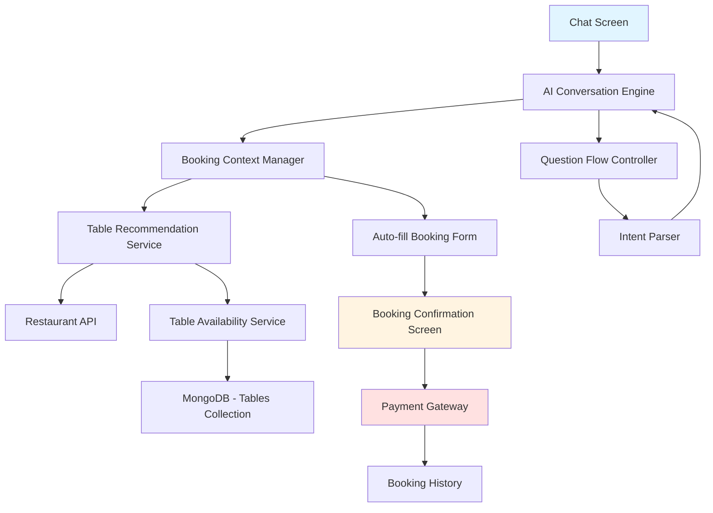
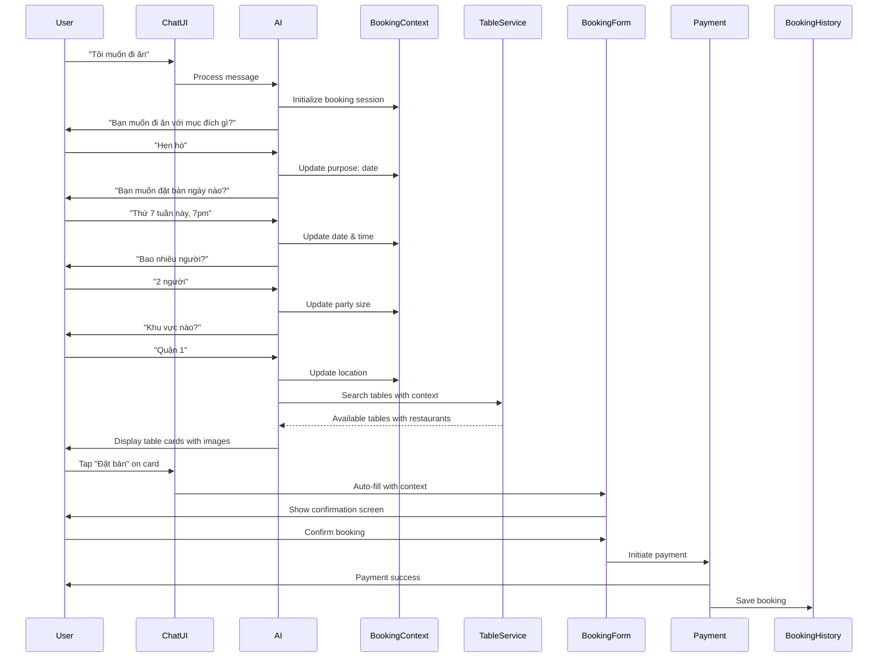

# Design Document: AI Chat Booking Flow with Auto-fill

## Overview

The AI Chat Booking Flow feature transforms the restaurant booking experience by enabling users to complete the entire reservation process through conversational AI. The system guides users through a natural chat interface, collecting booking preferences through intelligent questions, presenting specific table recommendations with visual previews, and auto-filling booking forms to minimize manual input. The flow seamlessly integrates chat interaction, table selection, confirmation, and payment into a unified experience that reduces friction and improves conversion rates.

This feature extends the existing Amble AI Chat system with booking-specific capabilities including guided conversation flows, table availability simulation, visual table galleries, auto-fill booking forms, and payment gateway integration. The design prioritizes user convenience by eliminating repetitive form filling while maintaining the existing confirmation and payment screens.

## Architecture




## Main Workflow Sequence




## Components and Interfaces

### Component 1: BookingContextManager

**Purpose**: Manages the state of the booking conversation, tracking user preferences and guiding the question flow.

**Interface**:
```typescript
interface BookingContextManager {
  initializeSession(userId: string): BookingSession;
  updateContext(sessionId: string, field: BookingField, value: any): void;
  getContext(sessionId: string): BookingContext;
  isComplete(sessionId: string): boolean;
  getNextQuestion(sessionId: string): Question | null;
}

interface BookingSession {
  id: string;
  userId: string;
  createdAt: Date;
  context: BookingContext;
  conversationHistory: ConversationTurn[];
}

interface BookingContext {
  purpose?: 'date' | 'family' | 'business' | 'celebration' | 'casual';
  date?: Date;
  time?: string;
  partySize?: number;
  location?: string;
  budget?: { min: number; max: number };
  style?: string[];
  tableType?: 'vip' | 'view' | 'regular';
}

type BookingField = keyof BookingContext;

interface Question {
  id: string;
  text: string;
  field: BookingField;
  type: 'text' | 'date' | 'number' | 'choice';
  options?: string[];
  validation?: (value: any) => boolean;
}
```

**Responsibilities**:
- Initialize and maintain booking session state
- Track conversation progress through required fields
- Determine next question based on collected information
- Validate user responses against field constraints
- Provide context for table recommendations


### Component 2: GuidedQuestionFlow

**Purpose**: Controls the sequence of questions asked to users and parses their natural language responses.

**Interface**:
```typescript
interface GuidedQuestionFlow {
  getQuestionSequence(): Question[];
  parseResponse(question: Question, userMessage: string): ParsedResponse;
  generateFollowUp(context: BookingContext): string;
}

interface ParsedResponse {
  field: BookingField;
  value: any;
  confidence: number;
  needsClarification: boolean;
  clarificationPrompt?: string;
}

interface ConversationTurn {
  timestamp: Date;
  question: Question;
  userResponse: string;
  parsedValue: any;
  aiMessage: string;
}
```

**Responsibilities**:
- Define the standard question sequence for booking
- Parse natural language responses into structured data
- Handle ambiguous responses with clarification prompts
- Generate contextual follow-up questions
- Support flexible conversation flow (skip optional questions)


### Component 3: TableRecommendationService

**Purpose**: Searches for available tables matching user preferences and formats them as interactive cards.

**Interface**:
```typescript
interface TableRecommendationService {
  searchTables(context: BookingContext): Promise<TableRecommendation[]>;
  getTableDetails(tableId: string): Promise<TableDetails>;
  checkAvailability(tableId: string, date: Date, time: string): Promise<boolean>;
}

interface TableRecommendation {
  id: string;
  restaurant: RestaurantInfo;
  table: TableInfo;
  images: string[];
  distance?: number;
  depositAmount: number;
  matchScore: number;
}

interface RestaurantInfo {
  id: string;
  name: string;
  image: string;
  rating: number;
  cuisine: string;
  tags: string[];
  address: string;
  city: string;
}

interface TableInfo {
  id: string;
  name: string;
  type: 'vip' | 'view' | 'regular';
  capacity: number;
  isAvailable: boolean;
  description: string;
  features: string[];
}

interface TableDetails extends TableInfo {
  gallery: string[];
  floorPlan?: string;
  nearbyTables: string[];
  amenities: string[];
}
```

**Responsibilities**:
- Query restaurants matching location and preferences
- Filter tables by type, capacity, and availability
- Calculate match scores based on user context
- Format results as chat message cards
- Provide detailed table information on request


### Component 4: AutoFillBookingForm

**Purpose**: Automatically populates booking form with collected context when user taps "Đặt bàn".

**Interface**:
```typescript
interface AutoFillBookingForm {
  createBookingDraft(
    sessionId: string,
    tableRecommendation: TableRecommendation
  ): BookingDraft;
  applyVoucher(draftId: string, voucherCode: string): Promise<BookingDraft>;
  validateDraft(draft: BookingDraft): ValidationResult;
}

interface BookingDraft {
  id: string;
  userId: string;
  restaurant: RestaurantInfo;
  table: TableInfo;
  date: Date;
  time: string;
  partySize: number;
  purpose: string;
  depositAmount: number;
  appliedVoucher?: Voucher;
  totalAmount: number;
  status: 'draft' | 'confirmed' | 'paid';
}

interface Voucher {
  code: string;
  discountType: 'percentage' | 'fixed';
  discountValue: number;
  description: string;
}

interface ValidationResult {
  isValid: boolean;
  errors: ValidationError[];
}

interface ValidationError {
  field: string;
  message: string;
}
```

**Responsibilities**:
- Create booking draft from conversation context
- Pre-fill all collected information
- Apply and validate voucher codes
- Calculate final amounts with discounts
- Validate booking before confirmation


### Component 5: BookingConfirmationScreen

**Purpose**: Displays booking summary and handles confirmation action (existing screen, enhanced with auto-filled data).

**Interface**:
```typescript
interface BookingConfirmationScreen {
  displayBookingSummary(draft: BookingDraft): void;
  confirmBooking(draftId: string): Promise<ConfirmedBooking>;
  editBooking(draftId: string, field: string, value: any): Promise<BookingDraft>;
}

interface ConfirmedBooking {
  id: string;
  bookingNumber: string;
  draft: BookingDraft;
  confirmedAt: Date;
  paymentRequired: boolean;
  paymentDeadline?: Date;
}
```

**Responsibilities**:
- Display complete booking summary with images
- Show applied vouchers and final amounts
- Allow minor edits before confirmation
- Transition to payment gateway
- Handle confirmation errors


### Component 6: PaymentGateway

**Purpose**: Handles payment processing for booking deposits (simulated for MVP).

**Interface**:
```typescript
interface PaymentGateway {
  initiatePayment(bookingId: string, amount: number): Promise<PaymentSession>;
  processPayment(
    sessionId: string,
    method: PaymentMethod
  ): Promise<PaymentResult>;
  verifyPayment(transactionId: string): Promise<PaymentStatus>;
}

interface PaymentSession {
  id: string;
  bookingId: string;
  amount: number;
  currency: string;
  expiresAt: Date;
  availableMethods: PaymentMethod[];
}

type PaymentMethod = 'apple_pay' | 'momo' | 'bank_transfer' | 'credit_card';

interface PaymentResult {
  success: boolean;
  transactionId?: string;
  error?: string;
  receiptUrl?: string;
}

interface PaymentStatus {
  transactionId: string;
  status: 'pending' | 'completed' | 'failed' | 'refunded';
  paidAt?: Date;
  amount: number;
}
```

**Responsibilities**:
- Create payment sessions with timeout
- Support multiple payment methods
- Process simulated payments
- Generate payment receipts
- Handle payment failures and retries


## Data Models

### Model 1: ChatMessage (Extended)

```typescript
interface ChatMessage {
  id: string;
  text: string;
  sender: 'user' | 'ai';
  timestamp: Date;
  
  // Existing
  restaurants?: Restaurant[];
  
  // New for booking flow
  messageType?: 'question' | 'response' | 'recommendation' | 'confirmation';
  bookingContext?: Partial<BookingContext>;
  tableRecommendations?: TableRecommendation[];
  bookingDraft?: BookingDraft;
  quickReplies?: QuickReply[];
}

interface QuickReply {
  id: string;
  text: string;
  value: any;
  action: 'answer' | 'skip' | 'view_details';
}
```

**Validation Rules**:
- `id` must be unique
- `sender` must be either 'user' or 'ai'
- `timestamp` must be valid Date
- `tableRecommendations` limited to 5 items per message
- `quickReplies` limited to 4 options per message


### Model 2: Table (New MongoDB Collection)

```typescript
interface Table {
  _id: string;
  restaurantId: string;
  name: string;
  type: 'vip' | 'view' | 'regular';
  capacity: { min: number; max: number };
  description: string;
  features: string[];
  images: string[];
  floorPlan?: string;
  location: {
    floor: number;
    zone: string;
    position: string;
  };
  pricing: {
    baseDeposit: number;
    peakHourMultiplier: number;
  };
  availability: TableAvailability[];
  isActive: boolean;
  createdAt: Date;
  updatedAt: Date;
}

interface TableAvailability {
  date: Date;
  timeSlots: TimeSlot[];
}

interface TimeSlot {
  time: string;
  isAvailable: boolean;
  reservedBy?: string;
  reservationId?: string;
}
```

**Validation Rules**:
- `restaurantId` must reference existing restaurant
- `capacity.min` must be >= 1
- `capacity.max` must be >= `capacity.min`
- `type` must be one of: 'vip', 'view', 'regular'
- `images` array must contain at least 1 image URL
- `pricing.baseDeposit` must be >= 0
- `availability` dates must be future dates only


### Model 3: Booking (New MongoDB Collection)

```typescript
interface Booking {
  _id: string;
  bookingNumber: string;
  userId: string;
  restaurantId: string;
  tableId: string;
  
  bookingDetails: {
    date: Date;
    time: string;
    partySize: number;
    purpose: string;
    specialRequests?: string;
  };
  
  pricing: {
    depositAmount: number;
    voucherDiscount: number;
    totalAmount: number;
    appliedVoucher?: Voucher;
  };
  
  status: 'draft' | 'confirmed' | 'paid' | 'completed' | 'cancelled';
  
  payment: {
    transactionId?: string;
    method?: PaymentMethod;
    paidAt?: Date;
    receiptUrl?: string;
  };
  
  conversationSessionId: string;
  
  createdAt: Date;
  updatedAt: Date;
  confirmedAt?: Date;
  cancelledAt?: Date;
  cancellationReason?: string;
}
```

**Validation Rules**:
- `bookingNumber` must be unique (format: BK-YYYYMMDD-XXXX)
- `userId` must reference existing user
- `restaurantId` must reference existing restaurant
- `tableId` must reference existing table
- `bookingDetails.date` must be future date
- `bookingDetails.time` must be valid time format (HH:mm)
- `bookingDetails.partySize` must be >= 1
- `pricing.totalAmount` must be >= 0
- `status` transitions must follow valid flow: draft → confirmed → paid → completed


## Key Functions with Formal Specifications

### Function 1: processBookingMessage()

```typescript
async function processBookingMessage(
  userId: string,
  message: string,
  sessionId?: string
): Promise<ChatMessage>
```

**Preconditions:**
- `userId` is valid and references existing user
- `message` is non-empty string
- If `sessionId` provided, it must reference active booking session

**Postconditions:**
- Returns ChatMessage with AI response
- If new session: `sessionId` is created and stored
- If existing session: booking context is updated with parsed information
- If context complete: table recommendations are included in response
- No side effects on user data beyond session state

**Loop Invariants:** N/A


### Function 2: searchAvailableTables()

```typescript
async function searchAvailableTables(
  context: BookingContext
): Promise<TableRecommendation[]>
```

**Preconditions:**
- `context.date` is valid future date
- `context.time` is valid time format
- `context.partySize` is positive integer
- `context.location` is non-empty string

**Postconditions:**
- Returns array of TableRecommendation sorted by match score (descending)
- All returned tables have `isAvailable === true` for specified date/time
- All returned tables have capacity >= `context.partySize`
- Array length <= 10 (top recommendations only)
- Each recommendation includes valid restaurant and table data

**Loop Invariants:**
- For table filtering loop: All previously checked tables meet capacity requirement
- For scoring loop: Match scores are calculated consistently for all tables


### Function 3: createBookingDraft()

```typescript
async function createBookingDraft(
  sessionId: string,
  tableRecommendation: TableRecommendation
): Promise<BookingDraft>
```

**Preconditions:**
- `sessionId` references active booking session with complete context
- `tableRecommendation.table.isAvailable === true`
- Session context contains all required fields: date, time, partySize

**Postconditions:**
- Returns valid BookingDraft with status 'draft'
- Draft contains all information from session context
- Draft.depositAmount is calculated from table pricing
- Draft is persisted to database
- Table availability is temporarily locked for 15 minutes

**Loop Invariants:** N/A


### Function 4: confirmBooking()

```typescript
async function confirmBooking(draftId: string): Promise<ConfirmedBooking>
```

**Preconditions:**
- `draftId` references existing BookingDraft with status 'draft'
- Draft has not expired (created within last 15 minutes)
- Table is still available for specified date/time
- All required fields in draft are valid

**Postconditions:**
- Returns ConfirmedBooking with status 'confirmed'
- Booking status updated from 'draft' to 'confirmed'
- Table availability updated to mark time slot as reserved
- Confirmation timestamp recorded
- Payment session created if deposit required

**Loop Invariants:** N/A


### Function 5: processPayment()

```typescript
async function processPayment(
  bookingId: string,
  method: PaymentMethod
): Promise<PaymentResult>
```

**Preconditions:**
- `bookingId` references confirmed booking with status 'confirmed'
- `method` is valid PaymentMethod
- Booking has not been paid yet
- Payment session has not expired

**Postconditions:**
- Returns PaymentResult indicating success or failure
- If successful: booking status updated to 'paid'
- If successful: transaction ID recorded in booking
- If successful: receipt URL generated
- If failed: booking remains in 'confirmed' status
- Payment attempt logged regardless of outcome

**Loop Invariants:** N/A


## Algorithmic Pseudocode

### Main Booking Conversation Algorithm

```typescript
async function handleBookingConversation(
  userId: string,
  userMessage: string,
  sessionId?: string
): Promise<ChatMessage> {
  // Step 1: Initialize or retrieve session
  let session: BookingSession;
  if (!sessionId) {
    session = bookingContextManager.initializeSession(userId);
  } else {
    session = bookingContextManager.getContext(sessionId);
  }
  
  // Step 2: Parse user message and extract booking information
  const currentQuestion = session.context.lastQuestion;
  const parsedResponse = questionFlow.parseResponse(currentQuestion, userMessage);
  
  // Step 3: Update booking context with parsed information
  if (parsedResponse.confidence > 0.7 && !parsedResponse.needsClarification) {
    bookingContextManager.updateContext(
      session.id,
      parsedResponse.field,
      parsedResponse.value
    );
  }
  
  // Step 4: Check if context is complete
  const isComplete = bookingContextManager.isComplete(session.id);
  
  if (isComplete) {
    // Step 5: Search for available tables
    const tables = await tableService.searchTables(session.context);
    
    // Step 6: Return recommendations
    return {
      id: generateId(),
      text: formatRecommendationMessage(tables),
      sender: 'ai',
      timestamp: new Date(),
      messageType: 'recommendation',
      tableRecommendations: tables,
    };
  } else {
    // Step 7: Ask next question
    const nextQuestion = bookingContextManager.getNextQuestion(session.id);
    
    return {
      id: generateId(),
      text: nextQuestion.text,
      sender: 'ai',
      timestamp: new Date(),
      messageType: 'question',
      bookingContext: session.context,
      quickReplies: generateQuickReplies(nextQuestion),
    };
  }
}
```

**Preconditions:**
- `userId` is valid user ID
- `userMessage` is non-empty string
- If `sessionId` provided, session exists and is active

**Postconditions:**
- Returns ChatMessage with appropriate response
- Session state is updated with new information
- If context complete, table recommendations are provided
- If context incomplete, next question is asked

**Loop Invariants:** N/A (no explicit loops in main flow)


### Table Search and Ranking Algorithm

```typescript
async function searchAvailableTables(
  context: BookingContext
): Promise<TableRecommendation[]> {
  // Step 1: Query restaurants matching location
  const restaurants = await restaurantApi.searchRestaurants({
    city: context.location,
    category: context.purpose,
  });
  
  const recommendations: TableRecommendation[] = [];
  
  // Step 2: For each restaurant, find available tables
  for (const restaurant of restaurants) {
    const tables = await Table.find({
      restaurantId: restaurant._id,
      isActive: true,
      'capacity.min': { $lte: context.partySize },
      'capacity.max': { $gte: context.partySize },
    });
    
    // Loop Invariant: All tables in 'tables' array meet capacity requirements
    
    for (const table of tables) {
      // Step 3: Check availability for specific date/time
      const isAvailable = await checkTableAvailability(
        table._id,
        context.date,
        context.time
      );
      
      if (isAvailable) {
        // Step 4: Calculate match score
        const matchScore = calculateMatchScore(table, restaurant, context);
        
        // Step 5: Create recommendation
        recommendations.push({
          id: generateId(),
          restaurant: formatRestaurantInfo(restaurant),
          table: formatTableInfo(table),
          images: table.images,
          distance: calculateDistance(restaurant.location, context.location),
          depositAmount: calculateDeposit(table, context),
          matchScore,
        });
      }
    }
  }
  
  // Step 6: Sort by match score and return top 10
  recommendations.sort((a, b) => b.matchScore - a.matchScore);
  return recommendations.slice(0, 10);
}
```

**Preconditions:**
- `context.date` is valid future date
- `context.time` is valid time string
- `context.partySize` > 0
- `context.location` is non-empty

**Postconditions:**
- Returns sorted array of available tables
- All returned tables are available for specified date/time
- All returned tables meet capacity requirements
- Array length <= 10
- Sorted by match score (highest first)

**Loop Invariants:**
- Restaurant loop: All processed restaurants match location criteria
- Table loop: All tables in current iteration meet capacity requirements
- Recommendation array: All items have valid restaurant and table data


### Match Score Calculation Algorithm

```typescript
function calculateMatchScore(
  table: Table,
  restaurant: RestaurantInfo,
  context: BookingContext
): number {
  let score = 0;
  
  // Base score from restaurant rating (0-50 points)
  score += restaurant.rating * 10;
  
  // Table type match (0-20 points)
  if (context.tableType && table.type === context.tableType) {
    score += 20;
  } else if (context.tableType) {
    score += 5; // Partial credit for any table when preference specified
  }
  
  // Purpose/category match (0-15 points)
  if (context.purpose && restaurant.categories.includes(context.purpose)) {
    score += 15;
  }
  
  // Budget match (0-10 points)
  if (context.budget) {
    const depositInRange = 
      table.pricing.baseDeposit >= context.budget.min &&
      table.pricing.baseDeposit <= context.budget.max;
    if (depositInRange) {
      score += 10;
    }
  }
  
  // Style/tags match (0-5 points)
  if (context.style && context.style.length > 0) {
    const matchingTags = restaurant.tags.filter(tag =>
      context.style.includes(tag.toLowerCase())
    );
    score += Math.min(matchingTags.length * 2, 5);
  }
  
  return score;
}
```

**Preconditions:**
- `table` is valid Table object
- `restaurant` is valid RestaurantInfo object
- `context` is valid BookingContext with at least location and partySize

**Postconditions:**
- Returns numeric score between 0 and 100
- Higher score indicates better match
- Score is deterministic for same inputs

**Loop Invariants:**
- Style matching loop: Score increases monotonically with each matching tag


### Auto-fill Booking Flow Algorithm

```typescript
async function handleBookingButtonTap(
  userId: string,
  sessionId: string,
  tableRecommendation: TableRecommendation
): Promise<void> {
  // Step 1: Retrieve booking context
  const context = bookingContextManager.getContext(sessionId);
  
  // Step 2: Verify table is still available
  const isAvailable = await tableService.checkAvailability(
    tableRecommendation.table.id,
    context.date,
    context.time
  );
  
  if (!isAvailable) {
    throw new Error('Table no longer available');
  }
  
  // Step 3: Create booking draft with auto-filled data
  const draft = await autoFillService.createBookingDraft(
    sessionId,
    tableRecommendation
  );
  
  // Step 4: Apply voucher if available in context
  if (context.voucherCode) {
    await autoFillService.applyVoucher(draft.id, context.voucherCode);
  }
  
  // Step 5: Validate draft
  const validation = autoFillService.validateDraft(draft);
  
  if (!validation.isValid) {
    throw new Error(`Validation failed: ${validation.errors[0].message}`);
  }
  
  // Step 6: Navigate to confirmation screen
  navigation.navigate('BookingConfirmation', {
    draftId: draft.id,
  });
}
```

**Preconditions:**
- `userId` is valid user ID
- `sessionId` references complete booking session
- `tableRecommendation` is valid recommendation from search results

**Postconditions:**
- If successful: booking draft created and user navigated to confirmation
- If table unavailable: error thrown, user remains on chat screen
- If validation fails: error thrown with specific validation message
- Session state preserved for retry

**Loop Invariants:** N/A


## Example Usage

### Example 1: Complete Booking Flow

```typescript
// User initiates booking conversation
const message1 = await processBookingMessage(
  'user123',
  'Tôi muốn đi ăn'
);
// AI Response: "Bạn muốn đi ăn với mục đích gì? (hẹn hò/gia đình/công việc/...)"

// User responds with purpose
const message2 = await processBookingMessage(
  'user123',
  'Hẹn hò',
  message1.sessionId
);
// AI Response: "Bạn muốn đặt bàn ngày nào?"

// User provides date and time
const message3 = await processBookingMessage(
  'user123',
  'Thứ 7 tuần này lúc 7 giờ tối',
  message1.sessionId
);
// AI Response: "Bao nhiêu người?"

// User provides party size
const message4 = await processBookingMessage(
  'user123',
  '2 người',
  message1.sessionId
);
// AI Response: "Bạn muốn đặt bàn ở khu vực nào?"

// User provides location
const message5 = await processBookingMessage(
  'user123',
  'Quận 1',
  message1.sessionId
);
// AI Response: Returns table recommendations with cards

// User taps "Đặt bàn" button on a card
await handleBookingButtonTap(
  'user123',
  message1.sessionId,
  message5.tableRecommendations[0]
);
// Navigates to confirmation screen with auto-filled data
```


### Example 2: Table Search with Filters

```typescript
// Search for tables with complete context
const context: BookingContext = {
  purpose: 'date',
  date: new Date('2024-02-10'),
  time: '19:00',
  partySize: 2,
  location: 'Quận 1',
  tableType: 'view',
  budget: { min: 300000, max: 800000 },
};

const tables = await searchAvailableTables(context);

// Returns sorted recommendations:
// [
//   {
//     restaurant: { name: 'The Rooftop Saigon', rating: 4.8, ... },
//     table: { name: 'View 03', type: 'view', ... },
//     matchScore: 85,
//     depositAmount: 500000,
//   },
//   {
//     restaurant: { name: 'Bistro Saigon', rating: 4.6, ... },
//     table: { name: 'Window 02', type: 'view', ... },
//     matchScore: 78,
//     depositAmount: 350000,
//   },
//   ...
// ]
```


### Example 3: Payment Processing

```typescript
// Confirm booking
const confirmed = await confirmBooking('draft_abc123');
// Returns: { id: 'booking_xyz789', status: 'confirmed', ... }

// Process payment
const paymentResult = await processPayment(
  confirmed.id,
  'momo'
);

if (paymentResult.success) {
  console.log('Payment successful!');
  console.log('Transaction ID:', paymentResult.transactionId);
  console.log('Receipt:', paymentResult.receiptUrl);
  
  // Booking status automatically updated to 'paid'
  // User sees success screen and booking saved to history
} else {
  console.error('Payment failed:', paymentResult.error);
  // User can retry payment or cancel booking
}
```


## Correctness Properties

### Universal Quantification Properties

1. **Booking Context Completeness**: ∀ session ∈ BookingSessions, if isComplete(session) = true, then session.context contains all required fields (purpose, date, time, partySize, location)

2. **Table Availability Consistency**: ∀ table ∈ TableRecommendations, ∀ (date, time) ∈ BookingContext, if table appears in search results, then checkAvailability(table.id, date, time) = true at time of search

3. **Capacity Constraint**: ∀ table ∈ TableRecommendations, ∀ context ∈ BookingContext, table.capacity.min ≤ context.partySize ≤ table.capacity.max

4. **Match Score Bounds**: ∀ table ∈ Tables, ∀ restaurant ∈ Restaurants, ∀ context ∈ BookingContext, 0 ≤ calculateMatchScore(table, restaurant, context) ≤ 100

5. **Booking Status Transitions**: ∀ booking ∈ Bookings, status transitions follow valid flow: draft → confirmed → paid → completed, and cancelled can occur from any state except completed

6. **Payment Idempotency**: ∀ booking ∈ Bookings, if booking.status = 'paid', then subsequent payment attempts for same booking fail with error

7. **Draft Expiration**: ∀ draft ∈ BookingDrafts, if (currentTime - draft.createdAt) > 15 minutes, then confirmBooking(draft.id) throws expiration error

8. **Voucher Application**: ∀ draft ∈ BookingDrafts, ∀ voucher ∈ Vouchers, if applyVoucher(draft.id, voucher.code) succeeds, then draft.totalAmount = draft.depositAmount - calculateDiscount(voucher)

9. **Question Sequence Ordering**: ∀ session ∈ BookingSessions, questions are asked in deterministic order: purpose → date/time → partySize → location → optional fields

10. **Recommendation Limit**: ∀ searchResults ∈ TableRecommendations[], searchResults.length ≤ 10

11. **Table Lock Duration**: ∀ draft ∈ BookingDrafts, table availability lock is held for exactly 15 minutes from draft creation

12. **Payment Session Validity**: ∀ paymentSession ∈ PaymentSessions, if currentTime > paymentSession.expiresAt, then processPayment(paymentSession.id) fails


## Error Handling

### Error Scenario 1: Table No Longer Available

**Condition**: User taps "Đặt bàn" but table was booked by another user between search and booking attempt

**Response**: 
- Display error message: "Xin lỗi, bàn này vừa được đặt. Vui lòng chọn bàn khác."
- Remove unavailable table from recommendations list
- Keep user on chat screen with remaining recommendations

**Recovery**: 
- User can select different table from remaining recommendations
- Or user can modify search criteria to get new recommendations

### Error Scenario 2: Booking Draft Expired

**Condition**: User takes longer than 15 minutes to confirm booking after creating draft

**Response**:
- Display error message: "Phiên đặt bàn đã hết hạn. Vui lòng thử lại."
- Release table availability lock
- Clear expired draft from database

**Recovery**:
- User returns to chat screen
- Session context preserved, user can quickly create new draft
- Or user can start new booking conversation

### Error Scenario 3: Payment Failed

**Condition**: Payment gateway returns error or user cancels payment

**Response**:
- Display error message with specific reason (insufficient funds, cancelled, timeout, etc.)
- Keep booking in 'confirmed' status
- Preserve payment session for retry

**Recovery**:
- User can retry payment with same or different method
- User can cancel booking if desired
- Payment session expires after 30 minutes, requiring new confirmation

### Error Scenario 4: Invalid Date/Time

**Condition**: User provides past date or time outside restaurant operating hours

**Response**:
- Display clarification message: "Ngày/giờ không hợp lệ. Vui lòng chọn ngày trong tương lai và trong giờ mở cửa."
- Provide quick reply buttons with valid time slots
- Do not update booking context with invalid value

**Recovery**:
- User provides corrected date/time
- Conversation continues from same question
- Context remains unchanged until valid input received


### Error Scenario 5: Network Timeout

**Condition**: API request times out during table search or booking creation

**Response**:
- Display error message: "Kết nối mạng không ổn định. Vui lòng thử lại."
- Show retry button
- Preserve all collected context

**Recovery**:
- User taps retry button to repeat failed operation
- Session state maintained, no data loss
- Implement exponential backoff for retries

### Error Scenario 6: Voucher Invalid

**Condition**: User applies voucher code that is expired, invalid, or not applicable

**Response**:
- Display specific error: "Mã voucher không hợp lệ" or "Mã voucher đã hết hạn"
- Show booking draft without voucher discount
- Allow user to proceed without voucher or try different code

**Recovery**:
- User can enter different voucher code
- User can proceed to confirmation without voucher
- Draft remains valid, only voucher application failed


## Testing Strategy

### Unit Testing Approach

**Key Test Cases**:

1. **BookingContextManager Tests**:
   - Test session initialization creates valid session with empty context
   - Test updateContext correctly updates specific fields
   - Test isComplete returns true only when all required fields present
   - Test getNextQuestion returns questions in correct order
   - Test getNextQuestion returns null when context complete

2. **GuidedQuestionFlow Tests**:
   - Test parseResponse correctly extracts date from various formats
   - Test parseResponse handles ambiguous responses with clarification
   - Test parseResponse confidence scoring for clear vs unclear responses
   - Test question sequence generation

3. **TableRecommendationService Tests**:
   - Test searchTables filters by capacity correctly
   - Test searchTables filters by availability correctly
   - Test searchTables returns max 10 results
   - Test searchTables sorts by match score descending
   - Test calculateMatchScore with various context combinations

4. **AutoFillBookingForm Tests**:
   - Test createBookingDraft populates all fields from context
   - Test applyVoucher calculates discount correctly
   - Test validateDraft catches missing required fields
   - Test validateDraft catches invalid date/time values

5. **Payment Gateway Tests**:
   - Test payment session creation with correct expiration
   - Test processPayment updates booking status on success
   - Test processPayment handles failures gracefully
   - Test payment idempotency (duplicate payment attempts)

**Coverage Goals**: 
- Minimum 80% code coverage for all services
- 100% coverage for critical paths (booking creation, payment processing)
- All error scenarios covered with explicit tests


### Property-Based Testing Approach

**Property Test Library**: fast-check (for TypeScript/JavaScript)

**Key Properties to Test**:

1. **Match Score Properties**:
   - Property: Match score is always between 0 and 100
   - Property: Higher restaurant rating always increases match score
   - Property: Exact table type match always scores higher than no match
   - Test with: Random combinations of table, restaurant, and context

2. **Booking Context Properties**:
   - Property: isComplete returns true iff all required fields are non-null
   - Property: Adding fields never makes context less complete
   - Test with: Random sequences of field updates

3. **Table Search Properties**:
   - Property: All returned tables meet capacity constraint
   - Property: Results are always sorted by match score descending
   - Property: No duplicate tables in results
   - Test with: Random booking contexts and table databases

4. **Date/Time Parsing Properties**:
   - Property: Parsed dates are always in the future
   - Property: Parsed times are always valid 24-hour format
   - Property: Invalid inputs always return needsClarification = true
   - Test with: Random date/time strings

5. **Voucher Discount Properties**:
   - Property: Discount never exceeds original amount
   - Property: Final amount is always non-negative
   - Property: Percentage discounts are correctly calculated
   - Test with: Random voucher configurations and booking amounts

**Example Property Test**:
```typescript
import fc from 'fast-check';

test('match score is always between 0 and 100', () => {
  fc.assert(
    fc.property(
      fc.record({
        rating: fc.float({ min: 0, max: 5 }),
        categories: fc.array(fc.string()),
        tags: fc.array(fc.string()),
      }),
      fc.record({
        type: fc.constantFrom('vip', 'view', 'regular'),
        pricing: fc.record({
          baseDeposit: fc.integer({ min: 0, max: 2000000 }),
        }),
      }),
      fc.record({
        purpose: fc.option(fc.string()),
        tableType: fc.option(fc.constantFrom('vip', 'view', 'regular')),
        budget: fc.option(fc.record({
          min: fc.integer({ min: 0 }),
          max: fc.integer({ min: 0 }),
        })),
      }),
      (restaurant, table, context) => {
        const score = calculateMatchScore(table, restaurant, context);
        return score >= 0 && score <= 100;
      }
    )
  );
});
```


### Integration Testing Approach

**Key Integration Test Scenarios**:

1. **End-to-End Booking Flow**:
   - Test complete flow from initial message to payment success
   - Verify all components interact correctly
   - Verify database state at each step
   - Verify navigation between screens

2. **Chat to Confirmation Integration**:
   - Test data flow from chat context to booking draft
   - Verify auto-fill correctly populates confirmation screen
   - Test back navigation preserves context

3. **Confirmation to Payment Integration**:
   - Test booking confirmation creates payment session
   - Verify payment success updates booking status
   - Test payment failure handling

4. **Database Consistency Tests**:
   - Test concurrent booking attempts for same table
   - Verify table locks prevent double booking
   - Test draft expiration cleanup

5. **API Integration Tests**:
   - Test restaurant API integration for search
   - Test table availability API calls
   - Test payment gateway API (mocked)

**Test Environment**:
- Use test database with seeded data
- Mock external payment gateway
- Use React Native Testing Library for UI tests
- Use Supertest for API endpoint tests


## Performance Considerations

### Response Time Requirements

- **Chat Message Processing**: < 500ms for question/answer flow
- **Table Search**: < 2 seconds for search with up to 100 restaurants
- **Booking Draft Creation**: < 300ms
- **Payment Processing**: < 3 seconds (excluding external gateway time)

### Optimization Strategies

1. **Caching**:
   - Cache restaurant data for 5 minutes to reduce database queries
   - Cache table availability for 30 seconds during active search
   - Use Redis for session state to enable horizontal scaling

2. **Database Indexing**:
   - Index tables by: restaurantId, type, capacity, isActive
   - Index bookings by: userId, status, date
   - Compound index on table availability: (tableId, date, time)

3. **Lazy Loading**:
   - Load table images on demand when user taps to view gallery
   - Paginate table recommendations (load 5 initially, more on scroll)

4. **Parallel Processing**:
   - Search multiple restaurants concurrently
   - Check table availability in parallel for all tables

5. **Message Batching**:
   - Batch multiple quick replies into single message
   - Combine question + context update in single operation

### Scalability Targets

- Support 1000 concurrent booking conversations
- Handle 100 bookings per minute during peak hours
- Maintain < 2s response time under peak load


## Security Considerations

### Authentication & Authorization

- All booking operations require authenticated user
- Verify user owns booking before allowing modifications
- Validate session ownership before accessing booking context
- Implement rate limiting on booking creation (max 5 per hour per user)

### Data Validation

- Sanitize all user inputs to prevent injection attacks
- Validate date/time ranges to prevent invalid bookings
- Verify table capacity constraints server-side
- Validate voucher codes against database, not client input

### Payment Security

- Use HTTPS for all payment-related communications
- Never store credit card details (use payment gateway tokens)
- Implement payment idempotency to prevent duplicate charges
- Log all payment attempts for audit trail
- Encrypt sensitive payment data in database

### Session Security

- Use secure session tokens with expiration
- Implement CSRF protection for booking confirmation
- Clear sensitive data from session after booking completion
- Prevent session hijacking with IP validation (optional)

### Privacy

- Do not log sensitive user information (payment details, personal data)
- Implement data retention policy for expired drafts (delete after 24 hours)
- Allow users to delete booking history
- Comply with data protection regulations (GDPR, PDPA)


## Dependencies

### Frontend Dependencies (React Native)

- **@react-navigation/native**: Navigation between chat, confirmation, and payment screens
- **react-native-gesture-handler**: Swipe gestures for image gallery
- **react-native-fast-image**: Optimized image loading for table photos
- **date-fns**: Date parsing and formatting for Vietnamese locale
- **@react-native-async-storage/async-storage**: Local session persistence

### Backend Dependencies (Node.js)

- **express**: REST API framework
- **mongoose**: MongoDB ODM for data models
- **node-cron**: Scheduled cleanup of expired drafts and locks
- **ioredis**: Redis client for session state and caching
- **joi**: Request validation schema
- **moment-timezone**: Date/time handling with timezone support

### External Services

- **Payment Gateway API**: MoMo, VNPay, or Stripe for payment processing (simulated in MVP)
- **MongoDB Atlas**: Database hosting
- **Redis Cloud**: Session state and caching
- **AWS S3 / Cloudinary**: Image storage for table photos

### Development Dependencies

- **jest**: Unit testing framework
- **fast-check**: Property-based testing library
- **@testing-library/react-native**: React Native component testing
- **supertest**: API endpoint testing
- **mongodb-memory-server**: In-memory MongoDB for tests

### Existing System Dependencies

- **Amble AI Service** (ambleAI.ts): Extended for booking conversation flow
- **Restaurant API** (restaurantApi.ts): Used for restaurant search
- **Authentication System**: User authentication for bookings
- **Chat UI** (chat.tsx): Extended with table cards and booking buttons
